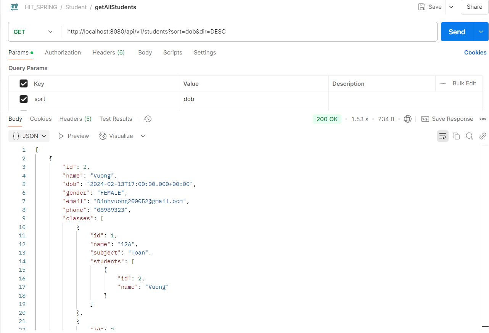
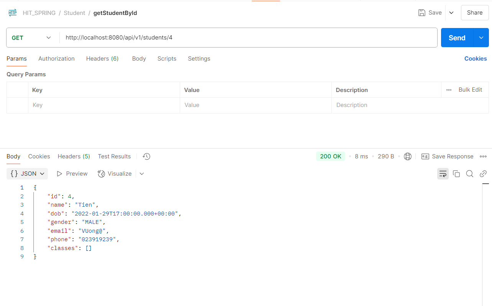
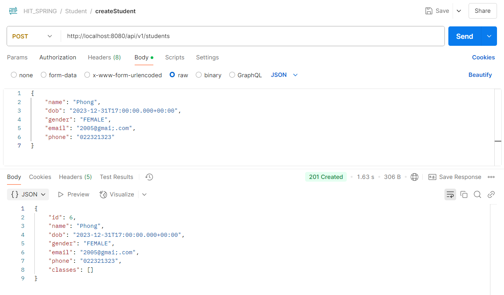
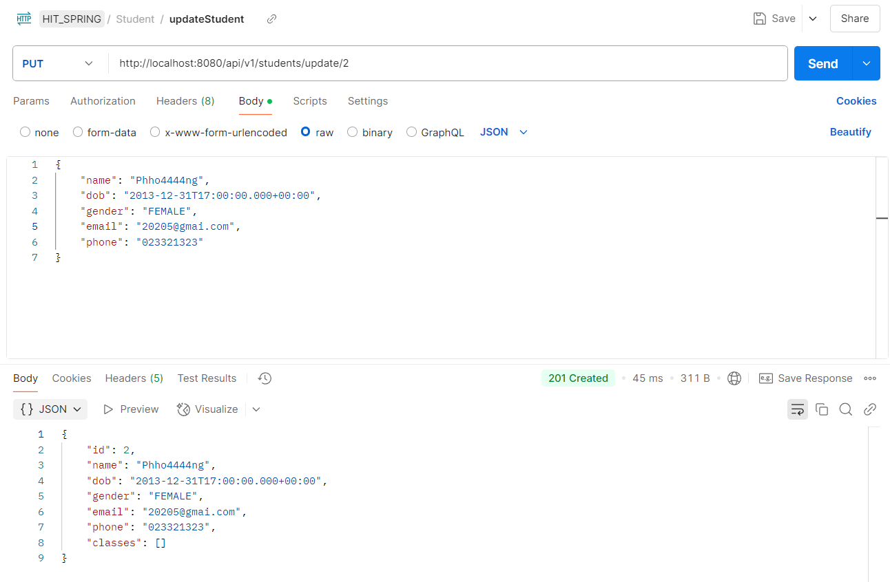
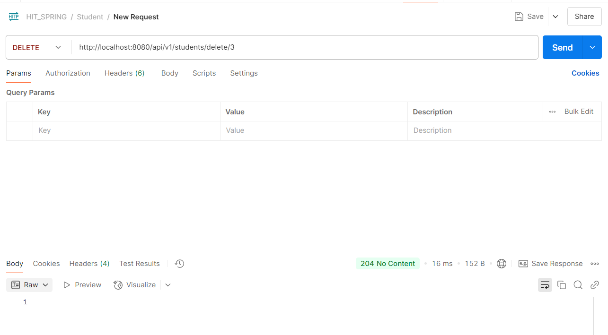

# Student & Class Management API

This project implements a RESTful API for managing student and class information. It provides endpoints for performing CRUD operations on both students and classes. The API supports features such as pagination, sorting, and input validation (using Jakarta Bean Validation for classes).

> **Note:** Exception messages and some comments are in Vietnamese, reflecting the original language of the project.

## Table of Contents

- [Introduction](#introduction)
- [Features](#features)
- [API Endpoints](#api-endpoints)
    - [Student Endpoints](#student-endpoints)
    - [Class Endpoints](#class-endpoints)
- [Technologies Used](#technologies-used)


## Introduction

The Student & Class Management API was developed to streamline the management of academic data. The API allows you to:
- Manage student records: create, retrieve, update, and delete student information.
- Manage class records: create, retrieve, update, and delete class information.
- Handle common errors by throwing a `ResourceNotFoundException` when data is not found.
- Validate input for class operations using the `@Valid` annotation.

## Features

- **CRUD Operations:** Full support for creating, reading, updating, and deleting both student and class entities.
- **Pagination & Sorting:** Supports pagination and sorting of results in the GET endpoints.
- **Input Validation:** Utilizes Jakarta Bean Validation (`@Valid`) in the ClassController to ensure that data passed to the API is valid.
- **Custom Exception Handling:** Throws a custom `ResourceNotFoundException` if a student or class is not found.
- **DTO Mapping:** Uses a mapping utility (`EntityToDTOMappe`) to convert entities into DTOs for cleaner responses.

## API Endpoints

### Student Endpoints

- **GET `/api/v1/students`**  
  Retrieve all students.  
  **Query Parameters:**
    - `page` (default: 0)
    - `size` (default: 1000)
    - `sort` (default: "id")
    - `dir` (default: "ASC") – sorting direction

  
  

- **GET `/api/v1/students/{id}`**  
  Retrieve a student by ID.  
  If the student is not found, a `ResourceNotFoundException` is thrown.




- **POST `/api/v1/students`**  
  Create a new student.  
  _Request Body Example:_
  ```json
  {
    "name": "vuong",
    "dob": "2005-8-27",
    "gender": "MALE",
    "email": "john.doe@example.com",
    "phone": "911"
  }




- **PUT `/api/v1/students/update/{id}`**  
  Update an existing student's information.  
  _Example Request Body:_
  ```json
  {
    "name": "vuong",
    "dob": "2005-8-27",
    "gender": "MALE",
    "email": "john.doe@example.com",
    "phone": "911"
  }




- **DELETE `/api/v1/students/delete/{id}`**  
  Delete a student by ID.  
  Returns a message "Xóa thành công" with HTTP status NO_CONTENT.  



### Class Endpoint

## Technologies Used  
- **Spring Boot: Framework for building Java-based REST APIs.**

- **Spring Data JPA: For database operations.**

- **Jakarta Bean Validation: For validating request bodies in class endpoints.**

- **Custom Exception Handling: Uses ResourceNotFoundException for resource errors.**

- **DTO Mapping: Utilizes a mapping utility to convert entities to DTOs.**

- **Maven: Build and dependency management.**

- **Pagination**